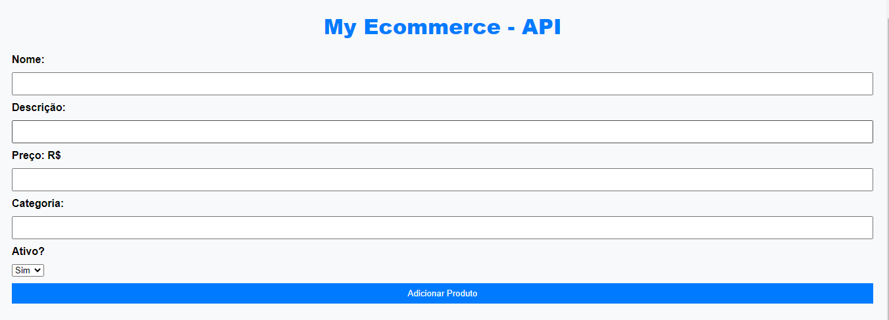
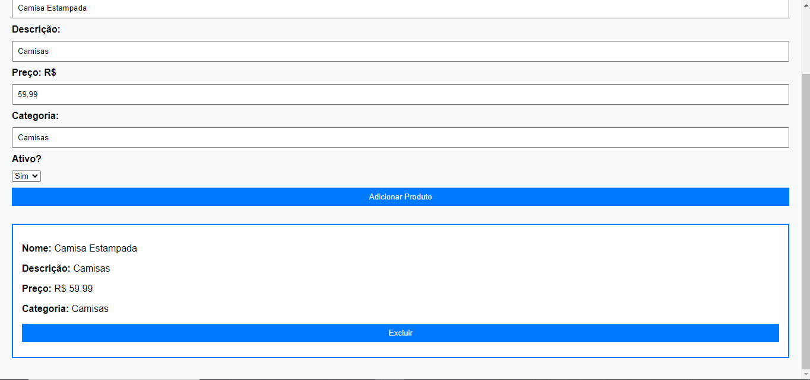

# Projeto

Este projeto consiste em uma API desenvolvida em Node.js com Typescript, utilizando o Express para simplificar o desenvolvimento e manutenção do código.





## Estrutura do Projeto

```plaintext
src
|-- controllers
|   `-- ProductController.ts
|-- routes
|   `-- ProductRoutes.ts
|-- models
|   `-- ProductModel.ts
`-- server.ts


(Todas as informações para rodar o projeto localmente estão disponíveis abaixo:)


## Para a modelagem do banco de dados, foi utilizado o PostgreSQL para:

- id;
- name;
- category;
- status (ACTIVE, INACTIVE);
- quantity;
- created_at;
- updated_at;
- deleted_at;

## Tecnologias Utilizadas:


- [Node.js]
- [TypeScript]
- [Express.JS]
- [npm]
- [PostgreSQL]

## Instalação:

git clone https://github.com/PhilipeMuzzi/loja.git
cd loja

npm install
npm install pg (para postgreSQL)
npm install --save-dev @types/sequelize
npm install --save-dev nodemon


## Configurações do Banco de Dados (.env)

- DB_HOST:localhost
- DB_PORT:5432
- DB_USER:seu_user
- DB_PASSWORD:password_db
- DB_NAME:database_name

## Ajuste as configurações de database em config\config.json

{
  "development": {
    "username": "seu_usuario",
    "password": "sua_senha",
    "database": "seu_banco_de_dados",
    "host": "localhost",
    "dialect": "postgres"
  }, 


5. Use o comando " npx sequelize-cli db:migrate " (sem aspas) para realizar o migrate do banco de dados.

Entre no diretório loja, que contém o script de start (cd loja)

E execute: npm start (para iniciar)

Acesse [http://localhost:3000](http://localhost:3000) para acessar a aplicação via index.html.

Acesse [http://localhost:3000/products](http://localhost:3000/products) para ver a API.

-------------------------------------------------------------------

## Possui:

- API Endpoints

- GET /products

- Get a product by ID:

- GET /products/:id

- Add new product:

- POST /products

- Update a product by ID:

- PUT /products/:id

- Delete a product by ID:

- DELETE /products/:id

--------------------------------------------------------------------


## Desde já, meu muito obrigado !
